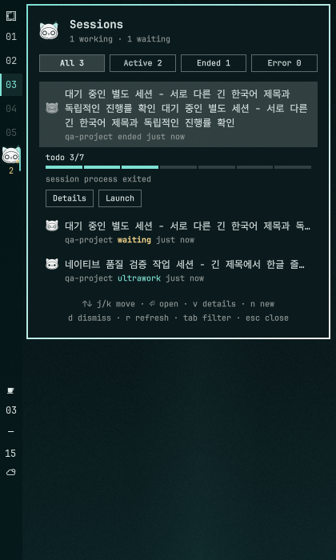

# OmO theme for Omarchy 4

[](https://github.com/tmdgusya/omarchy-omo-theme/releases/download/v3.0.0/omo-native-showreel.mp4)

▶ [Watch the 15-second showreel with sound](https://github.com/tmdgusya/omarchy-omo-theme/releases/download/v3.0.0/omo-native-showreel.mp4)


The OmO icon becomes the desktop: a light squircle plate, an ink cat with
ring eyes and a small `m`, and a thin monoline, repeated in the bar, the
session panel, the launcher, notifications, and the lock screen. A few OmO
cats nap on the wallpaper. Colour appears only when a state earns it: aqua
while OmO is working (with a small lightning bolt during verified
ultrawork), amber when it needs your decision, coral when it is stuck.

- **One key to start.** Press `SUPER + ALT + O`, type what you want done
  ("What would you like done?"), press Enter. OmO opens in Ghostty with that task.
- **A bar that shows the work.** The default preset puts a 32px bar on top:
  OmO menu button, ring workspace markers, OmO clock, and a cat cell with the
  number of running sessions. A left 36px variant is included.
- **Sessions at a glance.** Click the cat for Working / Needs you / Done,
  with real todo and verified-criteria counts (never a guessed ETA). Open
  focuses the existing window or resumes an ended session.
- **Honest motion.** The cat runs only while a session is verifiably working;
  idle draws nothing, and reduce-motion turns every loop into a still face.

## Connected provider usage

The bar replaces the Claude/Codex-only widget with OmO's connected-provider
view. Click its cat icon to see each provider's quota and reset time separately
from locally recorded OmO session tokens. The bar shows the provider count
and the highest available quota percentage, not an average.

Claude, Codex, Kimi and Z.AI use provider-reported quota windows. Every linked
account has its own row; blocked accounts stay visible with their status.
Account pins are not changed. The bar summarizes the highest available
percentage across accounts. Xiaomi quota requires a console login cookie;
the referenced Devin/Windsurf quota endpoint requires a Codeium key rather
than the linked Devin credential. Missing credentials are explained rather
than replaced with estimated percentages. Local token totals are
provider-wide session history, not per-account billing.
The installer records absolute Bun and Senpi paths so collection also works
outside a terminal's PATH.

## Install with an agent

Paste this into Claude Code, Codex, OmO (`omo`), or any coding agent running
on the Omarchy 4 machine you want to theme. It is written so the agent can
finish without asking you anything and stops if something looks wrong.

```text
Install the OmO theme for Omarchy 4 from https://github.com/tmdgusya/omarchy-omo-theme on this machine.

Rules:
- Run the steps below in order. If any command exits non-zero, stop and show me its exact output.
- Do not edit ~/.config/omarchy/shell.json, ~/.config/hypr/*, or the Omarchy menu file by hand. The scripts back them up and change only what they own.
- Do not run sudo, do not install fonts or cursors, and do not enable the lock-explorer plugin.

Steps:
1. Check prerequisites: `command -v omarchy git jq sha256sum python3 ghostty` must all succeed, and `command -v omo || command -v senpi` must succeed. If neither omo nor senpi exists, install OmO with `bun add -g omo-ai` and re-check.
2. Install and select the theme:
   omarchy theme install https://github.com/tmdgusya/omarchy-omo-theme.git
   omarchy theme set omo
3. Install everything (top bar by default; use `--position left` if I asked for a left bar):
   bash ~/.config/omarchy/themes/omo/scripts/install.sh --position top
4. Verify and show me the output. Every line must be PASS or SKIP:
   bash ~/.config/omarchy/themes/omo/scripts/verify-install.sh
5. Tell me: press SUPER+ALT+O, type a task, press Enter, and an OmO session opens in Ghostty. Sessions that were already running need /reload to be tracked.
```

### The same steps by hand

```sh
omarchy theme install https://github.com/tmdgusya/omarchy-omo-theme.git
omarchy theme set omo
bash ~/.config/omarchy/themes/omo/scripts/install.sh            # add --position left for a left bar
bash ~/.config/omarchy/themes/omo/scripts/verify-install.sh
```

`install.sh` runs the owned installers below in order, stops at the first
failure, and is safe to re-run. Skip parts with `--no-keybind`, `--no-menu`,
or `--no-pi-theme`.

| Step | Script | What it changes |
|---|---|---|
| Bar widget and services | `scripts/install-plugin.sh --track-all-sessions` | copies `plugin/` to `~/.config/omarchy/plugins/io.github.tmdgusya.omo` and enables it |
| Bar preset | `scripts/install-bar-preset.sh --position top` (or `left`) | backs up `shell.json`, installs the OmO menu button / workspaces / clock widgets, applies the layout as a delta |
| Shortcut | `scripts/install-keybind.sh` | appends one marked `SUPER + ALT + O` block to `~/.config/hypr/bindings.lua`; refuses if the key is taken |
| Menu | `scripts/install-menu.sh` | adds "OmO — What would you like done?" as the first OmO row in the Omarchy menu, keeping your own rows |
| Terminal palette | `scripts/install-pi-theme.sh` | selects the OmO palette for omo/senpi |

Remove everything with `bash ~/.config/omarchy/themes/omo/scripts/uninstall.sh`.
It reverses each step; files you have not edited since come back
byte-for-byte, and anything you changed is kept and reported.



This repository is an Omarchy 4 Quickshell theme. Its native theme slug is
`omo`; the optional bundled bar widget has ID `io.github.tmdgusya.omo`.
The theme lives at the repository root, while `plugin/` is copied separately.
The plugin bundle includes the bar/panel plus two keep-loaded native services:
verified session notifications and the Ambient Storm controller. The active
border effect is enabled by default; the wallpaper overlay remains **off by
default** and is opt-in from the OmO menu or plugin settings.
Omarchy's `plugin add` expects a plugin manifest at the **repository root**,
so do not use `omarchy plugin add` with this theme repository URL.

The wallpapers are `01-omo-day.png` (default: the plate cat with napping
cats, left third kept calm for terminals), `02-nightsea-storm.png` (the
ultrawork poster), `03-nightsea-open.png` (cat-free open sea), and
`04-nightsea-calm.png` (the v2 moon cat, and the live-overlay base).
`unlock.png` and `preview-unlock.png` are Plymouth assets; installation never
invokes the sudo-requiring Plymouth command.

## What each installer does

Omarchy 4 with its running Quickshell shell, `git`, `jq`, `sha256sum`, Bash,
and Python 3 for the widget's local session collector are required.
For launching sessions, install `omo` or `senpi` and Ghostty separately. The
only change to personal Hyprland configuration is the marked, removable
`SUPER + ALT + O` block; Ghostty configuration is never touched.

The plugin installer requires `plugin/manifest.json` and its QML entry point in the
cloned theme; it stops before changing configuration if either is missing.
It validates the bundled plugin, copies it to
`~/.config/omarchy/plugins/io.github.tmdgusya.omo/`, rescans, validates the
copy, and enables only that widget in the left bar section. It prints a
timestamped `shell.json` backup before the first change. A preexisting plugin
directory not marked as ours is never overwritten. Re-running updates only an
unmodified owned copy; it does not move a widget already in the layout.
Updated copies of the previous plugin remain under `.omo-previous.*` for
manual recovery. Updating an existing copy restarts the Omarchy shell so its
QML components use the new files; open shell panels briefly close.
The plugin installer also copies the owned `art/layers/` set required by the
default-off overlay. Both trees use ownership markers and checksums; modified
or foreign destinations are refused.

`install-menu.sh` merges only the five `omo.*` keys into
`~/.config/omarchy/extensions/omarchy-menu.jsonc`. It uses the same JSONC
contract as the host instead of passing the file through standard JSON, keeps
comments and `remote.*` entries, writes a timestamped backup, and records the
owned values. Removal refuses an edited owned key and never restores a whole
config over unrelated changes.

`install-pi-theme.sh` copies `pi.json` to
`${SENPI_CODING_AGENT_DIR:-~/.omo/agent}/themes/omo-nightsea.json` and selects
only the `theme` setting. Senpi prefers `settings.jsonc` when it exists, so the
installer does too and preserves its comments. Removal restores the prior
theme only while the current value is still the installer-applied
`omo-nightsea`; a later user choice wins. Use `omo --use-theme omo-nightsea`
for a one-off run without changing settings.

For Launch, the installer prefers `omo` in its invocation PATH, falls back to
`senpi`, and saves its absolute path in `launcherPath`. The older `senpiPath`
setting remains available for existing panel integrations and is preserved on
updates. If neither command is found, installation prints a notice. Set the
absolute path manually if necessary:

```sh
omarchy bar set io.github.tmdgusya.omo launcherPath "$(command -v omo)"
```

Run that command in an environment where `command -v omo` finds the desired
executable. Launch passes the setting as a direct Ghostty argv element, along
with `-e` for the installed `omo-status.ts` when global tracking is not enabled;
it does not invoke a login shell.

**Recommended: track all OmO sessions, not only bar-launched sessions:**

```sh
bash "$HOME/.config/omarchy/themes/omo/scripts/install-plugin.sh" --track-all-sessions
```

This registers the copied `omo-status.ts` using `senpi install` in
`SENPI_CODING_AGENT_DIR` (or `~/.omo/agent`) and records the exact source and
agent directory in `.omo-install.json`. Future sessions using that agent
directory load it automatically. Existing sessions can run `/reload` without
restarting; Senpi fires `session_start` with reason `reload`. Removal
unregisters only the recorded source. Re-running the installer preserves
tracking even if the flag is omitted.

`install-bar-preset.sh --position top|left` is the OmO bar preset. It writes
a timestamped `shell.json` backup, records the prior position, transparency,
and layout in `~/.config/omarchy/.omo-bar-preset.json`, copies the bundled
`extras/` widgets (OmO menu button, ring workspaces, OmO clock) with
ownership markers, and applies the layout only through the `omarchy bar` and
`omarchy plugin` commands: it swaps the stock menu, workspaces, and clock for
the OmO ones and leaves every other module where it was. Top uses a 32px bar,
left a 36px bar. `uninstall-bar-preset.sh` restores the recorded layout and
removes only the owned widget directories. The older `install-plugin.sh
--top-bar` flag only moves the bar and is superseded by the preset.

`install-keybind.sh` refuses to run if `SUPER + ALT + O` is already bound in
`~/.config/hypr` or the Omarchy defaults, writes a backup, appends one marked
block that calls `omarchy-shell omoLauncher toggle`, and reloads Hyprland.
`uninstall-keybind.sh` removes the block only while it is unedited.

## Opt-in features

The Storm wallpaper overlay is intentionally not enabled by any installer.
Toggle it from the installed OmO menu or set it explicitly:

```sh
omarchy bar set io.github.tmdgusya.omo ambientOverlay true --json
```

It renders only during a verified live ultrawork state and stops for reduced
motion, fullscreen, a non-calm wallpaper, or service shutdown.

The custom `lock/OmO.qml` design is also opt-in and requires the separately
installed `io.github.sirjul1337.lock-explorer` plugin. It is gated by a clean
24 hour shell soak because that plugin was implicated in an earlier memory
incident. The soak tool does not wait or poll: start it, continue using the
desktop normally, and finish it after at least 24 hours. Finish succeeds only
for the same live process and RSS growth no greater than 150 MiB.

```sh
bash "$HOME/.config/omarchy/themes/omo/scripts/soak-shell.sh" start
# at least 24 hours later:
bash "$HOME/.config/omarchy/themes/omo/scripts/soak-shell.sh" finish
bash "$HOME/.config/omarchy/themes/omo/scripts/install-lock.sh" --lock-explorer
```

The receipt is written to `~/.local/state/omo/soak/latest.json`. A successful
lock install copies only `OmO.qml` and `omo-lock-assets/`, then selects
`my-omo`, `rise`, and 280 ms. Its marker records the prior Explorer enabled
state and settings. Uninstall restores only values that still equal the
installer-applied values; edited files are never deleted.

## Update and removal

To update, pull the theme and re-run the installer so the copied plugin and
bar widgets follow:

```sh
omarchy theme update                                      # git pull in every theme installed from a repo
bash ~/.config/omarchy/themes/omo/scripts/install.sh      # add --position left if you use the left bar
```

Running `omarchy theme install` again also works, but it deletes the
same-slug theme directory before recloning it, so check for local edits
first. `omarchy plugin update` does not update this
locally copied plugin. If its installed files were edited, the script refuses
to replace them; save or reconcile those changes first.

```sh
bash "$HOME/.config/omarchy/themes/omo/scripts/uninstall-lock.sh"  # only if the opt-in lock was installed
bash "$HOME/.config/omarchy/themes/omo/scripts/uninstall.sh"
omarchy theme set matte-black
omarchy theme current
omarchy theme remove omo
```

Select and verify another installed theme **before** removing `omo`. The
uninstaller disables only its widget (if enabled), then uses `omarchy plugin
remove ... --yes`. Omarchy retains a backup of manually installed plugins.
Neither script deletes unrelated layout entries, other plugins, extension
folders, or user configuration. The lock uninstaller is only applicable after
the opt-in lock installer; the default installation creates no lock design.

## Optional senpi session state

Without live evidence the widget never claims a session is working. Sessions
with user/assistant activity in the last ten minutes are `recent` (unverified
and never animated); older sessions remain `unknown`. The optional
`plugin/omo-status.ts` extension supplies process-bound session state using
private, local-only metadata under `XDG_RUNTIME_DIR/omo-session-state/`:
session ID, PID, process start tick, state, and waiting flag. No prompt,
transcript, or credential is sent anywhere by this metadata. It requires a
private runtime directory. Without global tracking, the supported load
mechanism is an explicit per-process `-e` with the installed plugin copy:

```sh
SENPI_CODING_AGENT_DIR="$HOME/.omo/agent" \
  senpi -e "$HOME/.config/omarchy/plugins/io.github.tmdgusya.omo/omo-status.ts"
```

Without the tracking option the copied extension is loaded only when passed
to a new process. A session started without it can become tracked after
`/reload` once global registration is installed.
Launch uses the same agent directory as the collector: the widget's
`agentDir` override, then `SENPI_CODING_AGENT_DIR` or `OMO_CODING_AGENT_DIR`,
then `~/.omo/agent`. It does not silently open a separate empty senpi profile.
Turn events update a private revision signal watched by the bar, so short
turns do not have to wait for the background polling interval.
Omarchy syncs its generated `pi.json` to `~/.pi/agent`, not senpi's
`~/.omo/agent`; use `install-pi-theme.sh` for the explicit, reversible Senpi
copy. This theme installs no background synchronization hook.

The model exposes focus for a uniquely verified Hyprland window, resume for
an ended or old unverified session, and a blocked result for a verified
running session without a window or a recent unverified session. A blocked
session must never spawn a second writer. Details reads a bounded session
summary, Launch requires Ghostty and the configured launcher,
and Dismiss acknowledges a displayed error. A goal marked in progress does
not by itself prove that a session is working.

## Development checks

```sh
PYTHONDONTWRITEBYTECODE=1 python3 -B -m unittest discover -s tests -v
bun test tests
omarchy plugin validate plugin
for d in extras/*/; do omarchy plugin validate "$d"; done
bash -n scripts/*.sh
```

The tests use isolated fixtures; desktop visual checks still require the
real Omarchy shell. To rebuild the wallpapers, install Bun, ImageMagick and
`rsvg-convert`, then run `bun art/build-wallpapers.mjs --render`.

## Attribution and license

Original code and theme configuration are MIT licensed. The OmO icon and
cat-derived wallpaper/SVG assets retain the upstream Sustainable Use License
1.0, including its non-commercial distribution conditions. `LICENSE` lists
the affected files and reproduces both sets of terms.

The OmO cat icon reference in `art/reference/omo-icon-light.svg` comes from
[code-yeongyu/oh-my-openagent](https://github.com/code-yeongyu/oh-my-openagent/blob/dev/.github/assets/omo-icon-light.svg).
That repository's [LICENSE.md](https://github.com/code-yeongyu/oh-my-openagent/blob/dev/LICENSE.md)
identifies its own content as subject to the Sustainable Use License 1.0,
with separately licensed third-party components. See `LICENSE` for the
original terms and attribution; this repository does not claim the icon is
MIT, public domain, or owned by this theme.
